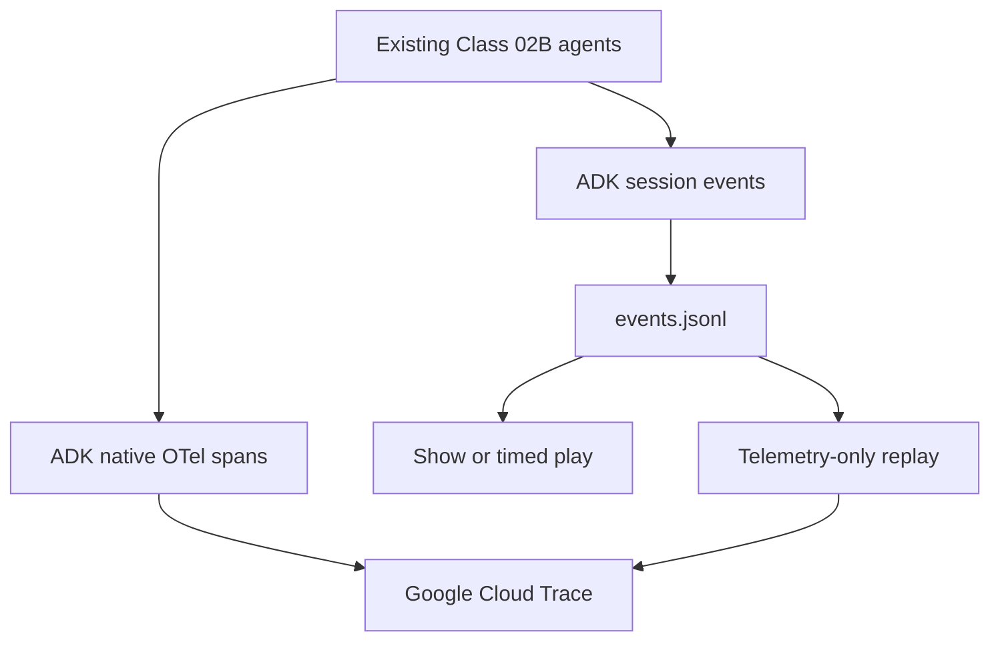

# Class 02C — OpenTelemetry with Google Cloud Trace

This lab adds observability to the existing Class 02B multi-agent system **without changing the Class 02B source code**.

## Starter package

After expanding `class-02C.zip`, enter the package:

```bash
unzip class-02C.zip
cd class-02C
```

The package includes the complete Class 02B codebase directly in the `class-02C/` root, plus ready-to-run helper utilities under `class-02C-work/`. There is no nested archive to expand.

You will:

1. run the existing Class 02B agents with ADK's native OpenTelemetry export;
2. inspect the live execution in Google Cloud Trace;
3. record the ADK session event history as JSONL;
4. show and play the recorded events locally; and
5. replay the recording as a new OpenTelemetry trace in the same Google Cloud project.

There is no Jaeger server, local collector, or separate observability backend. Google Cloud Trace is the only trace backend.

## What “no code changes” means

Do not edit:

```text
adk_multiagent_systems/
pyproject.toml
scripts/
```

Class 02C creates its generated files in the supplied work directory:

```text
class-02C-work/
├── sessions.db
├── run-01.json
├── run-02.json
├── session.json
├── events.jsonl
└── replay_events.py
```

Installing an additional Python package in `.venv`, setting shell environment variables, and creating files in `class-02C-work` do not modify the Class 02B source code.

## Architecture



## Learning objectives

By the end of the lab, you can:

- distinguish an ADK Event from an OpenTelemetry span event;
- identify a trace, span, parent span, attribute, status, and duration;
- export ADK's native agent, workflow, model, and tool spans to Cloud Trace;
- retrieve the chronological event history stored in an ADK session;
- record the events as portable JSON Lines;
- play the recording without calling the agent; and
- replay the recording as a new trace without calling Gemini or executing tools.

---

## Task 0 — Expand and verify the package

Expand the self-contained archive and enter it:

```bash
unzip class-02C.zip
cd class-02C
```

The complete Class 02B agent code is already present under `adk_multiagent_systems/`. If its guided TODOs are not complete, use `CLASS_02B_INSTRUCTIONS.md` before running the advanced workflows.

Activate the existing environment, or create it if necessary:

```bash
if [[ ! -d .venv ]]; then
  python3 -m venv .venv
fi

source .venv/bin/activate
python -m pip install --upgrade pip
python -m pip install -e .
```

Class 02C needs ADK's Google Cloud OpenTelemetry integration. Install it in the virtual environment without editing `pyproject.toml`:

```bash
python -m pip install "google-adk[otel-gcp]==2.6.0"
```

Verify the inherited package:

```bash
python scripts/validate_starter.py
python -c "import google.adk; print('ADK', google.adk.__version__)"
```

The existing `.env` must already support either Gemini API-key mode or Vertex AI mode. If the inherited Class 02B code does not run yet, complete Task 1 in `CLASS_02B_INSTRUCTIONS.md` before continuing.

### Verify the inherited source baseline

The package includes a checksum manifest created from the original Class 02B archive. Verify it before beginning:

```bash
export CLASS02C_ROOT="$PWD"
export CLASS02C_WORK="$PWD/class-02C-work"

./class-02C-work/verify_class02b_unchanged.sh
```

Run the same verifier again at the end of the lab.

---

## Task 1 — Configure Google Cloud Trace

Set the project that will receive both the live and replayed traces:

```bash
export PROJECT_ID=replace_with_your_google_cloud_project_id
gcloud config set project "$PROJECT_ID"
```

Authenticate Application Default Credentials:

```bash
gcloud auth application-default login
gcloud auth application-default set-quota-project "$PROJECT_ID"
```

Enable the required Google Cloud APIs:

```bash
gcloud services enable \
  cloudtrace.googleapis.com \
  logging.googleapis.com \
  monitoring.googleapis.com \
  --project="$PROJECT_ID"
```

If the Class 02B model uses Vertex AI, also enable:

```bash
gcloud services enable aiplatform.googleapis.com --project="$PROJECT_ID"
```

Confirm that ADC can issue a token:

```bash
gcloud auth application-default print-access-token >/dev/null \
  && echo "Application Default Credentials: OK"
```

### Required access

The runtime identity needs permission to write traces. For a service account, the normal least-privilege role is:

```text
roles/cloudtrace.agent
```

The person inspecting traces normally needs permissions included in:

```text
roles/cloudtrace.user
```

In a managed classroom project, ask the administrator to provision access. Do not grant a broad role merely to make the lab pass.

---

## Task 2 — Start the unchanged agents with native telemetry

From `class-02C`, load the existing model configuration and add telemetry settings to the current shell only:

```bash
cd "$CLASS02C_ROOT"
source .venv/bin/activate

set -a
source .env
set +a

export GOOGLE_CLOUD_PROJECT="$PROJECT_ID"
export OTEL_SERVICE_NAME=class-02c-live
export OTEL_RESOURCE_ATTRIBUTES="deployment.environment=classroom,class.name=02C"
export OTEL_INSTRUMENTATION_GENAI_CAPTURE_MESSAGE_CONTENT=NO_CONTENT
```

Start the ADK API server:

```bash
adk api_server \
  --otel_to_cloud \
  --port 8000 \
  --session_service_uri="sqlite:///$CLASS02C_WORK/sessions.db" \
  adk_multiagent_systems
```

Why this works:

- `--otel_to_cloud` enables ADK's native OpenTelemetry export to Google Cloud Observability.
- `OTEL_SERVICE_NAME` makes the live traces easy to filter.
- the SQLite session database is stored under `class-02C-work`, outside the inherited agent source;
- `NO_CONTENT` avoids copying prompt and response text into telemetry; and
- no agent, tool, plugin, callback, or workflow file is changed.

Leave this terminal running.

---

## Task 3 — Create a session and record a live run

Open a second terminal:

```bash
cd class-02C
source .venv/bin/activate

export CLASS02C_ROOT="$PWD"
export CLASS02C_WORK="$PWD/class-02C-work"
export BASE_URL=http://127.0.0.1:8000
export APP_NAME=workflow_agents
export USER_ID=class02c-user
export SESSION_ID="class02c-$(date +%Y%m%d-%H%M%S)"
```

Confirm that ADK discovered both applications:

```bash
curl -sS "$BASE_URL/list-apps" | jq .
```

Expected applications:

```text
parent_and_subagents
workflow_agents
```

Create a new persistent session:

```bash
curl -sS -X POST \
  "$BASE_URL/apps/$APP_NAME/users/$USER_ID/sessions/$SESSION_ID" \
  -H 'Content-Type: application/json' \
  -d '{}' \
  | jq .
```

Send the first message:

```bash
jq -n \
  --arg app "$APP_NAME" \
  --arg user "$USER_ID" \
  --arg session "$SESSION_ID" \
  --arg text "Hello" \
  '{
    appName: $app,
    userId: $user,
    sessionId: $session,
    newMessage: {role: "user", parts: [{text: $text}]}
  }' \
  | curl -sS -X POST "$BASE_URL/run" \
      -H 'Content-Type: application/json' \
      --data-binary @- \
  | tee "$CLASS02C_WORK/run-01.json" \
  | jq 'map({timestamp, author, id, invocationId})'
```

Send the historical figure that starts the existing movie workflow:

```bash
jq -n \
  --arg app "$APP_NAME" \
  --arg user "$USER_ID" \
  --arg session "$SESSION_ID" \
  --arg text "Ada Lovelace" \
  '{
    appName: $app,
    userId: $user,
    sessionId: $session,
    newMessage: {role: "user", parts: [{text: $text}]}
  }' \
  | curl -sS -X POST "$BASE_URL/run" \
      -H 'Content-Type: application/json' \
      --data-binary @- \
  | tee "$CLASS02C_WORK/run-02.json" \
  | jq 'map({timestamp, author, id, invocationId})'
```

This is the only step that executes the agent, calls Gemini, and may call tools.

---

## Task 4 — Record the ADK Events as JSONL

ADK stores the chronological event history inside the session. Retrieve the complete session:

```bash
curl -sS \
  "$BASE_URL/apps/$APP_NAME/users/$USER_ID/sessions/$SESSION_ID" \
  | tee "$CLASS02C_WORK/session.json" \
  | jq -c '.events[]' \
  > "$CLASS02C_WORK/events.jsonl"
```

Confirm the recording:

```bash
wc -l "$CLASS02C_WORK/events.jsonl"
jq -s 'length' "$CLASS02C_WORK/events.jsonl"
```

Each line is one complete ADK Event. The file is a recording of the event history, not a second observability backend.

---

## Task 5 — Show the recorded events

Display a compact event table:

```bash
printf 'TIME\tAUTHOR\tPART TYPES\tSTATE KEYS\n'

jq -r '
  ([.content.parts[]? | keys[]] | unique | join(",")) as $parts
  | ((.actions.stateDelta // {}) | keys | join(",")) as $state
  | [
      (.timestamp | tostring),
      (.author // "unknown"),
      (if $parts == "" then "event" else $parts end),
      (if $state == "" then "-" else $state end)
    ]
  | @tsv
' "$CLASS02C_WORK/events.jsonl"
```

Look for:

- different agent authors;
- text, function call, and function response parts;
- the shared `invocationId` for events in one request; and
- state changes written by the inherited tools.

---

## Task 6 — Play the recording at human speed

This command reads only the JSONL file. It does not contact ADK, Gemini, Wikipedia, or Google Cloud:

```bash
while IFS= read -r event; do
  jq -r '
    ([.content.parts[]? | keys[]] | unique | join(",")) as $parts
    | "[\(.author // "unknown")] \(if $parts == "" then "event" else $parts end)"
  ' <<<"$event"
  sleep 0.75
done < "$CLASS02C_WORK/events.jsonl"
```

Change `0.75` to `0.25` for faster playback or `1.5` for slower playback.

---

## Task 7 — Create the external telemetry replayer

The starter already supplies this utility as `class-02C-work/replay_events.py`. You may skip the next creation block. It is retained as a teaching reference and as a way to reconstruct the utility if it is accidentally removed:

```bash
cat > "$CLASS02C_WORK/replay_events.py" <<'PY'
#!/usr/bin/env python3
"""Replay an ADK JSONL event recording as a fresh Google Cloud trace."""

from __future__ import annotations

import argparse
import json
import os
import time
from pathlib import Path
from typing import Any


def load_events(path: Path) -> list[dict[str, Any]]:
    records: list[dict[str, Any]] = []
    with path.open("r", encoding="utf-8") as handle:
        for line_number, line in enumerate(handle, start=1):
            if not line.strip():
                continue
            value = json.loads(line)
            if not isinstance(value, dict):
                raise ValueError(f"Line {line_number} is not a JSON object")
            records.append(value)
    return records


def event_types(event: dict[str, Any]) -> str:
    kinds: list[str] = []
    for part in (event.get("content") or {}).get("parts") or []:
        if not isinstance(part, dict):
            continue
        if "text" in part:
            kinds.append("text")
        if "functionCall" in part:
            kinds.append("function_call")
        if "functionResponse" in part:
            kinds.append("function_response")
        if "inlineData" in part:
            kinds.append("inline_data")
    state_delta = ((event.get("actions") or {}).get("stateDelta") or {})
    if state_delta:
        kinds.append("state_delta")
    return ",".join(dict.fromkeys(kinds)) or "event"


def attributes(event: dict[str, Any], sequence: int) -> dict[str, Any]:
    actions = event.get("actions") or {}
    state_delta = actions.get("stateDelta") or {}
    return {
        "replay.telemetry_only": True,
        "recorded.event.sequence": sequence,
        "recorded.event.id": str(event.get("id") or ""),
        "recorded.event.author": str(event.get("author") or "unknown"),
        "recorded.event.type": event_types(event),
        "recorded.invocation_id": str(event.get("invocationId") or ""),
        "recorded.state_delta.keys": ",".join(sorted(state_delta)),
    }


def planned_timestamps(events: list[dict[str, Any]], speed: float) -> list[int]:
    raw = [float(event.get("timestamp") or 0.0) for event in events]
    first = raw[0]
    relative = [max(0.0, timestamp - first) / speed for timestamp in raw]
    anchor = time.time_ns() - int(relative[-1] * 1_000_000_000) - 1_000_000_000
    return [anchor + int(delta * 1_000_000_000) for delta in relative]


def emit(events: list[dict[str, Any]], project_id: str, speed: float) -> None:
    os.environ["GOOGLE_CLOUD_PROJECT"] = project_id
    os.environ["OTEL_SERVICE_NAME"] = "class-02c-replay"
    os.environ["OTEL_RESOURCE_ATTRIBUTES"] = (
        "deployment.environment=classroom,class.name=02C,replay.mode=telemetry_only"
    )

    from google.adk.telemetry.google_cloud import get_gcp_exporters
    from google.adk.telemetry.setup import maybe_set_otel_providers
    from opentelemetry import trace

    exporters = get_gcp_exporters(enable_cloud_tracing=True)
    maybe_set_otel_providers([exporters])

    provider = trace.get_tracer_provider()
    tracer = trace.get_tracer("class-02c.event-replay")
    timestamps = planned_timestamps(events, speed)

    root = tracer.start_span(
        "replay.adk.session",
        start_time=timestamps[0],
        attributes={
            "replay.telemetry_only": True,
            "replay.event_count": len(events),
            "replay.source_invocation_id": str(events[0].get("invocationId") or ""),
        },
    )
    parent_context = trace.set_span_in_context(root)

    try:
        for sequence, (event, start_time) in enumerate(
            zip(events, timestamps, strict=True), start=1
        ):
            event_attributes = attributes(event, sequence)
            author = event_attributes["recorded.event.author"]
            span = tracer.start_span(
                f"replay.event.{author}",
                context=parent_context,
                start_time=start_time,
                attributes=event_attributes,
            )
            span.add_event(
                "recorded.adk.event",
                attributes=event_attributes,
                timestamp=start_time,
            )
            span.end(end_time=start_time + 1_000_000)
    finally:
        root.end(end_time=timestamps[-1] + 10_000_000)
        force_flush = getattr(provider, "force_flush", None)
        if callable(force_flush):
            force_flush()
        shutdown = getattr(provider, "shutdown", None)
        if callable(shutdown):
            shutdown()


def main() -> None:
    parser = argparse.ArgumentParser()
    parser.add_argument("recording", type=Path)
    parser.add_argument("--project-id", default=os.getenv("GOOGLE_CLOUD_PROJECT"))
    parser.add_argument("--speed", type=float, default=4.0)
    parser.add_argument("--dry-run", action="store_true")
    args = parser.parse_args()

    if args.speed <= 0:
        parser.error("--speed must be greater than zero")

    events = load_events(args.recording)
    if not events:
        raise SystemExit("The recording contains no events")

    if args.dry_run:
        print(f"Would replay {len(events)} events")
        for sequence, event in enumerate(events, start=1):
            print(
                f"{sequence:03d} "
                f"{event.get('author', 'unknown')}: "
                f"{event_types(event)}"
            )
        return

    if not args.project_id:
        raise SystemExit("Set GOOGLE_CLOUD_PROJECT or pass --project-id")

    emit(events, args.project_id, args.speed)
    print(
        f"Replayed {len(events)} events to Google Cloud Trace "
        f"in project {args.project_id}"
    )


if __name__ == "__main__":
    main()
PY

chmod +x "$CLASS02C_WORK/replay_events.py"
python -m py_compile "$CLASS02C_WORK/replay_events.py"
```

The utility reconstructs telemetry only. It imports no Class 02B agent and invokes no model or tool.

---

## Task 8 — Preview and export the replay trace

Preview the replay plan without sending telemetry:

```bash
python "$CLASS02C_WORK/replay_events.py" \
  "$CLASS02C_WORK/events.jsonl" \
  --dry-run
```

Export the replay to Google Cloud Trace:

```bash
export GOOGLE_CLOUD_PROJECT="$PROJECT_ID"

python "$CLASS02C_WORK/replay_events.py" \
  "$CLASS02C_WORK/events.jsonl" \
  --project-id "$PROJECT_ID" \
  --speed 4
```

Expected terminal result:

```text
Replayed <N> events to Google Cloud Trace in project <PROJECT_ID>
```

---

## Task 9 — Inspect the live and replayed traces

In Google Cloud Console:

1. Select `PROJECT_ID`.
2. Open **Observability → Trace Explorer**.
3. Set the time window to the last 30 minutes.
4. Filter first for service `class-02c-live`.
5. Open the newest live trace.
6. Inspect agent, workflow, model, and tool spans.
7. Filter for service `class-02c-replay`.
8. Open the newest `replay.adk.session` trace.

Compare the two traces:

| Live trace — `class-02c-live` | Replay trace — `class-02c-replay` |
|---|---|
| Created by the real ADK execution | Created from `events.jsonl` |
| Native agent, workflow, model, and tool spans | One reconstructed child span per recorded event |
| Real runtime duration | Scaled relative event timing |
| May call Gemini and tools | Calls no model and executes no tool |
| Original trace and span IDs | New trace and span IDs |

Replay preserves the recorded story. It does not reproduce the original execution.

---

## Task 10 — Prove that Class 02B was not changed

Return to the Class 02C package root and verify the inherited Class 02B source and configuration:

```bash
cd "$CLASS02C_ROOT"
./class-02C-work/verify_class02b_unchanged.sh
```

Every line should end with:

```text
OK
```

The only new lab artifacts should be in:

```bash
find "$CLASS02C_WORK" -maxdepth 1 -type f -print | sort
```

---

## Success criteria

The lab is complete when:

- [ ] no Class 02B Python or project file was edited;
- [ ] the unchanged agent runs through the ADK API server;
- [ ] Cloud Trace displays a `class-02c-live` trace;
- [ ] `events.jsonl` contains the ordered ADK session events;
- [ ] the show command displays event authors and types;
- [ ] the playback command displays the recording without executing the agent;
- [ ] Cloud Trace displays a `class-02c-replay` trace;
- [ ] replay performs no model call or tool side effect; and
- [ ] the student can explain why live execution and telemetry replay are different.

---

## Troubleshooting

### `jq: command not found`

Google Cloud Shell normally includes `jq`. On Debian or Ubuntu:

```bash
sudo apt-get update
sudo apt-get install -y jq
```

### `adk: command not found`

```bash
cd class-02C
source .venv/bin/activate
which python
which adk
```

### `No module named ... opentelemetry ...`

Install the ADK telemetry extra in the active virtual environment:

```bash
python -m pip install "google-adk[otel-gcp]==2.6.0"
```

### The API server does not list the agents

Start it from `class-02C` and pass the agents directory explicitly:

```bash
adk api_server --otel_to_cloud --port 8000 adk_multiagent_systems
```

### `Session already exists`

Generate a new ID:

```bash
export SESSION_ID="class02c-$(date +%Y%m%d-%H%M%S)"
```

### The agent responds, but no live trace appears

Confirm the project, credentials, and API:

```bash
gcloud config get-value project
gcloud auth application-default print-access-token >/dev/null \
  && echo "ADC: OK"
gcloud services list \
  --enabled \
  --project="$PROJECT_ID" \
  --filter='name:cloudtrace.googleapis.com'
```

Restart the API server, run a new session, wait briefly for exporter flush, and widen the Trace Explorer time window.

### API-key mode works, but Trace export fails

The Gemini API key authenticates the model call only. Google Cloud Trace still requires:

- `GOOGLE_CLOUD_PROJECT`;
- Application Default Credentials;
- the Cloud Trace API; and
- trace-write permission.

### Replay succeeds, but the trace is not visible

Check that:

```bash
echo "$PROJECT_ID"
echo "$GOOGLE_CLOUD_PROJECT"
gcloud config get-value project
```

all identify the same project. Then filter Trace Explorer for `class-02c-replay` and use the last 30 minutes.

### Replay has different durations

That is expected. Replay creates a new trace with scaled relative timestamps. It preserves order and selected event metadata, not original runtime measurement.

---

## Privacy note

The live server uses:

```bash
OTEL_INSTRUMENTATION_GENAI_CAPTURE_MESSAGE_CONTENT=NO_CONTENT
```

The JSONL session recording can still contain user messages, model responses, tool arguments, tool results, and state. Treat it as classroom data. Do not record secrets, credentials, personal information, or regulated data.

---

## Official references

- ADK traces: <https://adk.dev/observability/traces/>
- ADK Google Cloud Trace integration: <https://adk.dev/integrations/cloud-trace/>
- ADK API server and session endpoints: <https://adk.dev/runtime/api-server/>
- ADK events: <https://adk.dev/events/>
- ADK sessions: <https://adk.dev/sessions/session/>
- Google Cloud Trace IAM: <https://cloud.google.com/trace/docs/iam>
